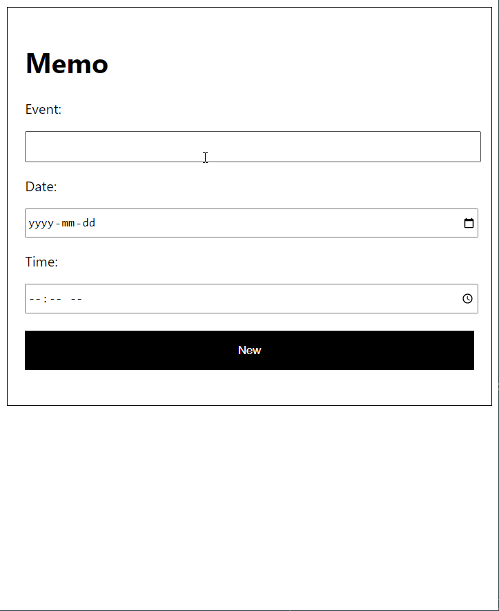
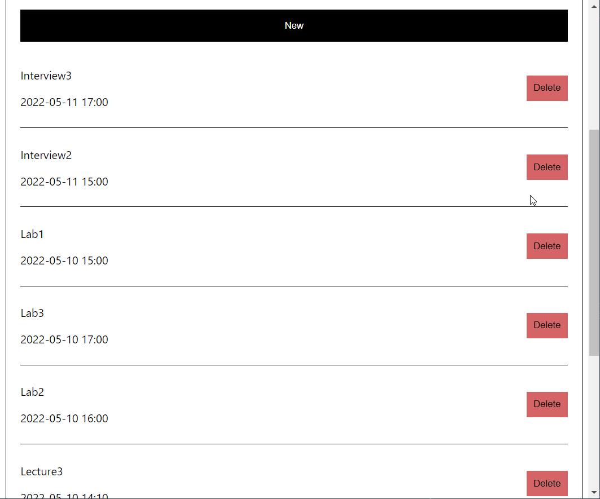

# Memo Web App
Memo Wep App is an open-source browser app built with React.js that allows users to add event reminders.

## What will the application do?
- This application allows the user to add an arbitrary numbr of new events with specified date and time to a memo app.

- This application also allows the user to delete any number of events added earlier.

## Installation
- Git clone: https://github.com/terryChou28/Memo-Web-App.git
- Run npm start in the development mode.
- Open http://localhost:3000 to view it in the browser.